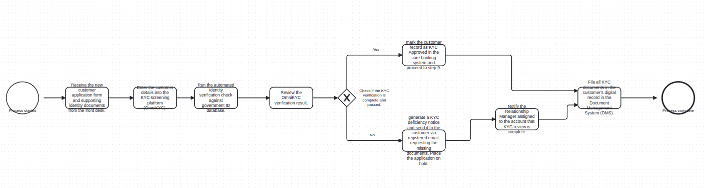
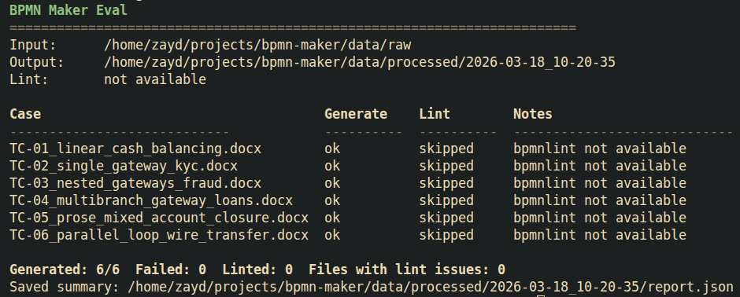

# BPMN Maker

A prototype to convert structured SOP `.docx` files into BPMN 2.0 XML.

## Approach

The project implements the below pipeline:

1. `DocxReader` reads the document into ordered paragraphs.
2. `NLPParser` applies heuristics to detect tasks, gateways, and branch targets.
3. `ProcessModel` stores the workflow as typed nodes and sequence flows.
4. `BPMNBuilder` and `LinearLayoutEngine` generate BPMN XML that can be opened in bpmn.io.

This keeps parsing, modeling, and XML generation separate so each part can be extended independently.

Tradeoffs:

- Heuristic parsing is fast, but it is less reliable on messy SOP wording.
- A lightweight internal model keeps the code easy to extend, but it supports limited set of BPMN.
- The layout is intentionally basic producing polished diagrams, but may not scale to very complex structures.

## Architecture


## Assumptions

- SOPs use numbered steps or a clear `Procedure Steps` section.
- `if/then` logic appears as `If [condition], ...` on its own line or inline.
- One condition maps to one exclusive gateway.
- No loops or parallel flows are in scope.
- Layout is intentionally simple and left-to-right.

## How To Run

Install `uv`:

```bash
curl -LsSf https://astral.sh/uv/install.sh | sh
```

Sync dependencies:

```bash
uv sync
```

```bash
uv run bpmn-maker <input.docx> <output.bpmn>
```

Example:

```bash
uv run bpmn-maker data/raw/TC-02_single_gateway_kyc.docx out_2.bpmn
```

## Example Output

### TC-02 Single Gateway KYC

Source: `data/raw/TC-02_single_gateway_kyc.docx`



## Eval

Install the BPMN linter dependencies first:

```bash
npm install
```

Run the batch evaluation:

```bash
uv run bpmn-maker-eval
```

This reads from `data/raw`, runs `bpmnlint` on each generated diagram when available, and writes timestamped outputs to `data/processed/<timestamp>/`.



## Current Limitations

- Merge gateways are handled simply.
- Parallel flows and loops are out of scope.
- Parsing is heuristic and works best on predictable SOP wording.
- BPMN layout is basic and not optimized for large diagrams.

## What I'd Improve

- Add an LLM-based parser to detect decision boundaries, parse messy SOP content, and return a `ProcessModel`.
- Replace the simple layout engine with a proper Dagre or Graphviz-based layout.
- Add support for complete BPMN specification including parallel gateways.
- Build a stronger evaluation suite with a human-annotated dataset that spans simple to complex SOPs.
- Add a storage layer to track existing SOPs and their generated BPMN artifacts.
- Add an update engine so incoming SOP revisions can update or replace an existing BPMN graph.
- Introduce a task queue with `asyncio` and Redis to parallelize document processing at scale.
